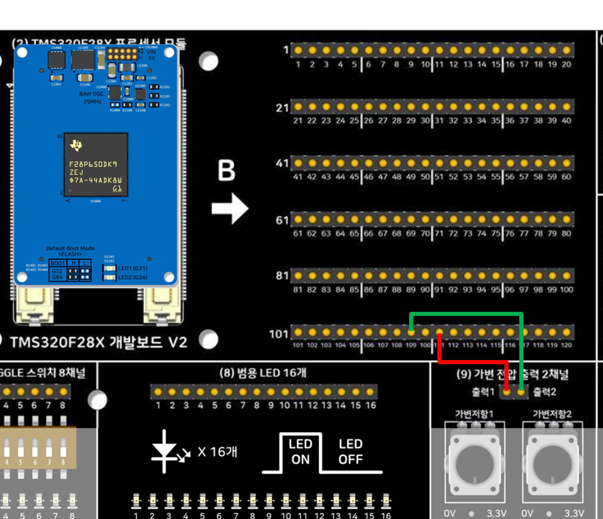

# 가변 전압 출력 2채널 테스트 — 비트필드(레지스터 직접 제어) 버전 — TMS320F28P659DK8-Q1

[9_VariableVoltage2Ch_Driverlib](../9_VariableVoltage2Ch_Driverlib/README.md)(DriverLib 버전)와
동일한 동작을 **DriverLib을 전혀 쓰지 않고** TI의 클래식 레지스터 비트필드 구조체
(`AdcaRegs`, `GpioCtrlRegs`, `AnalogSubsysRegs`)만으로 구현했습니다. `driverlib.lib` 자체가
이 프로젝트에는 없습니다.

## 이 버전의 핵심
- 시스템 초기화: `InitSysCtrl()` (DriverLib의 `Device_init()`에 대응, 클래식 헬퍼)
- GPIO 아날로그 모드 전환: `GpioCtrlRegs.GPHMUX1.bit.GPIO227/228 = 0`(GPIO 기능) +
  `GpioCtrlRegs.GPHAMSEL.bit.GPIO227/228 = 1` + `AnalogSubsysRegs.AGPIOCTRLH.bit.GPIO227/228 = 1`
  — DriverLib 버전의 `GPIO_setPinConfig()`/`GPIO_setAnalogMode()`와 정확히 대응됩니다.
- **ADC 설정**: `ADCCTL2`/`ADCSOC0CTL`/`ADCSOC1CTL`/`ADCINTSEL1N2` 레지스터를 직접 씀 —
  DriverLib 버전의 `ADC_setPrescaler()`/`ADC_setupSOC()`/`ADC_setInterruptSource()` 등과
  정확히 대응되는 지점입니다.
- **OTP trim 로드**: RESOLUTION/SIGNALMODE 비트를 직접 쓰지 않고 반드시 `AdcSetMode()`
  (`device/f28p65x_adc.c`, C2000Ware 제공)를 거칩니다 — 공장 출하 시 OTP에 저장된 선형성
  (INL) trim 값을 로드하는 필수 단계입니다.

## 요구 하드웨어
- SyncWorks TMS320F28X 개발보드 V2
- TMS320F28P650DK9 또는 TMS320F28P659DK8-Q1 모듈
- 점퍼 케이블 2개

## 배선 (DriverLib, FreeRTOS 예제와 100% 동일)

개발보드 B Side 핀-헤더와 보드의 **(9) 가변 전압 출력 2채널** 블록을 점퍼 와이어로 연결하세요:

| 채널 | 가변 전압 출력 | ADC 입력 (B Side) |
|---|---|---|
| **1채널** | 출력1 (가변저항1) | ──▶ **B Side 111번** (ADCINA0) |
| **2채널** | 출력2 (가변저항2) | ──▶ **B Side 109번** (ADCINA1) |

> **안내**: F28P65x에서 A0/A1은 AIO227/AIO228로 디지털 GPIO와 멀티플렉싱되어 있어,
> `GPHAMSEL`/`AGPIOCTRLH`를 아날로그 모드로 설정해야 신호가 정상 유입됩니다(전용 아날로그
> 핀이 아닙니다). 핀 매핑 근거: `SYNCWORKS_DEVBOARDV2_F28P65X.syscfg.json`.

## 소프트웨어 버전
CCS 21.x / **SysConfig·C2000Ware 라이브러리 링크 없음** (products="C2000WARE"만 사용) /
CGT 22.6.3.LTS. `device/common_include`, `device/headers_include`에 필요한 클래식 헤더를
전부 복사해 자기완결형으로 만들었습니다.

## Import → Build → Flash → Run
1. CCS에서 `CCS/9_VariableVoltage2Ch_Bitfield.projectspec`를 Import
2. Build (CPU1_RAM 또는 CPU1_FLASH)
3. Debug 연결 후 Flash/Run — `.ccxml`은 XDS2xx USB 디버그 프로브 설정을 사용합니다
   (DK8-Q1 최초 연결 시 확인 필요, DriverLib 버전과 동일한 주의사항)

## 정상 동작 확인

CCS Expressions 창에 아래 변수를 등록하고 Continuous Refresh를 켠 뒤, 보드의 가변전압
출력 블록 로터리 손잡이를 돌리면서 값이 매끄럽게 바뀌는지 확인하세요:

- `adcResultCh1`, `adcResultCh2` — 0~4095 범위의 원본 12비트 ADC 코드
- `adcVoltageCh1_mV`, `adcVoltageCh2_mV` — 0~3300 범위, mV 단위로 환산된 값
- `conversionCount` — 계속 증가하면 변환 루프가 정상적으로 돌고 있는 것입니다.

## 세 가지 버전 비교
| 버전 | 폴더 | 핵심 차이 |
|---|---|---|
| DriverLib | [9_VariableVoltage2Ch_Driverlib](../9_VariableVoltage2Ch_Driverlib/) | TI 표준 HAL 함수 호출 |
| **비트필드(이 폴더)** | 9_VariableVoltage2Ch_Bitfield | 레지스터 구조체 직접 조작, DriverLib 미사용 |
| FreeRTOS | [9_VariableVoltage2Ch_Freertos](../9_VariableVoltage2Ch_Freertos/) | DriverLib + 태스크 스케줄링, 정적 할당 |

### 메모리 실측 비교 (2026-09-18, CCS 21.x / C:\ti\ccs2100, CPU1_RAM 빌드, `.map` 기준)

세 프로젝트 모두 `C:\Users\vosam\workspace_ccstheia`에서 실제로 Import → Build까지 성공한
뒤의 `.map` 파일(TI 링커 Grand Total, 16비트 워드 단위)을 기준으로 한 실측치입니다 —
추정이 아닙니다.

| 버전 | code | ro data | rw data | 합계 |
|---|---:|---:|---:|---:|
| DriverLib | 3,504 | 853 | 1,032 | **5,389** |
| **비트필드(이 폴더)** | 3,756 | 474 | 2,837 | **7,067** |
| FreeRTOS | 5,556 | 1,080 | 1,241 | **7,877** |

- **이 비트필드 버전의 rw data(2,837)가 DriverLib(1,032)보다 훨씬 큰 이유**는 클래식
  헤더(`f28p65x_globalvariabledefs.obj`)가 이 예제와 무관한 페리페럴까지 포함한 전체
  레지스터 맵을 전역 선언하면서 rw data에 2,565워드를 잡아먹기 때문입니다 — 실제
  애플리케이션 자체가 쓰는 rw data는 `adcResultCh1/2`, `adcVoltageCh1/2_mV`,
  `conversionCount`를 합쳐 6워드뿐입니다.
- **code(3,756)가 DriverLib(3,504)보다 큰 이유**도 마찬가지로 클래식 인터럽트 벡터
  스텁(`f28p65x_defaultisr.obj`, 2,013워드)과 `InitSysCtrl()` 등 초기화 헬퍼(862워드)
  때문입니다 — 정작 애플리케이션 로직 자체는 이 비트필드 버전이 162워드로
  DriverLib(583워드)보다 훨씬 작습니다.

## 관련 링크
- 상품 페이지: https://tms320f28x.co.kr/goods/goods_view.php?goodsNo=200903127
- 게시판 글: https://tms320f28x.co.kr/board/view.php?bdId=tms320f28xevmv2&sno=108
- 유튜브 영상: (게시 후 URL 추가 예정)
